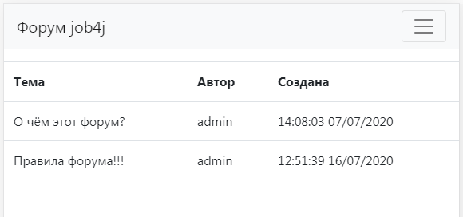

# job4j_forum   
### Проект JavaEE демонстрирующий работу с framework'ом Spring (core/Data/Boot/Test).
Представляет из себя форум.
Данный проект реализован при прохождение курса [Java Job4j.ru](https://job4j.ru/)

## Демонстрация

Проект развёрнут на портале [Heroku](https://vast-peak-67874.herokuapp.com/)

##  Примечания
Для прохождения автоматических тестов потребуется наличие:
1. [PostgreSQL](https://www.postgresql.org) 
2. Пользователь `postgres` с паролем `password`
3. База данных под названем `forum`

Для размещения на на Heroku потребуется настроить _Config Vars_ в _Settings_: KEY = `MAVEN_SETTINGS_PATH`,
VALUE = `heroku-settings.xml`. Это необходимо для выбора паравильного профиля Maven.

## Сылки

* [Основной проэкт, демонстрирующий ООП, Java core, SOLID.](https://github.com/QmBo/job4j)